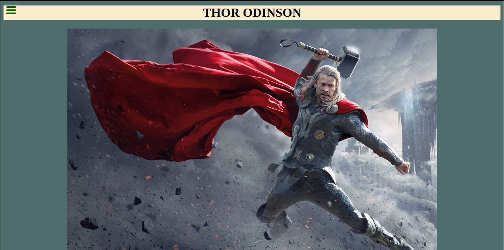

# Tribute Page

> In this project, I will set up a Tribute Page repository from one of my Microverse Admission Trial projects. My goal here is to master all of the tools and best practices I've learned about GitHub flow rules, .gitignore file, linters for HTML and CSS, and documenting my work in a professional way.

In this project I will write a review that checks for all the requirements that meet the best practices for writing code.

## Built With

- Html/Css
- JavaScript
- Babel

## Authors

👤 **Simo Nkosi**

- GitHub: [@githubhandle](https://github.com/KDlamini)
- Twitter: [@twitterhandle](https://twitter.com/RealSimoNkosi)
- LinkedIn: [LinkedIn](https://www.linkedin.com/in/simo-nkosi-418523180/)

## 🤝 Contributing

Contributions, issues, and feature requests are welcome!

## Show your support

Give a ⭐️ if you like this project!

## Acknowledgments

- This project is part of week 2 of module 1 in the Microverse study program.

## 📝 License

This project is [MIT](./MIT.md) licensed.
